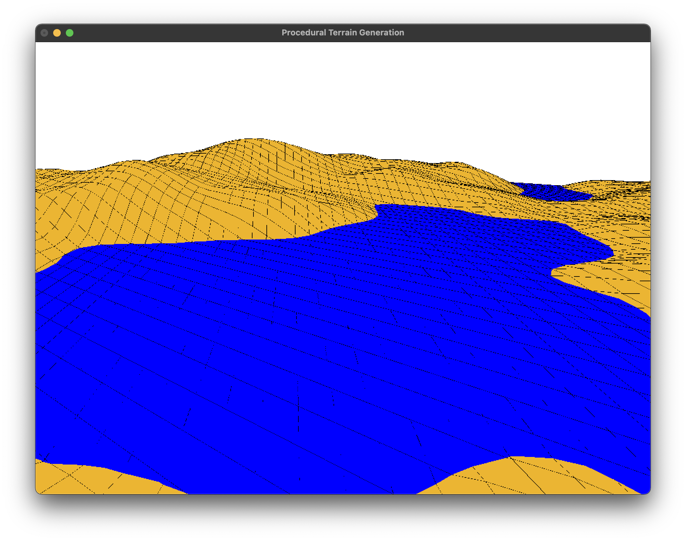
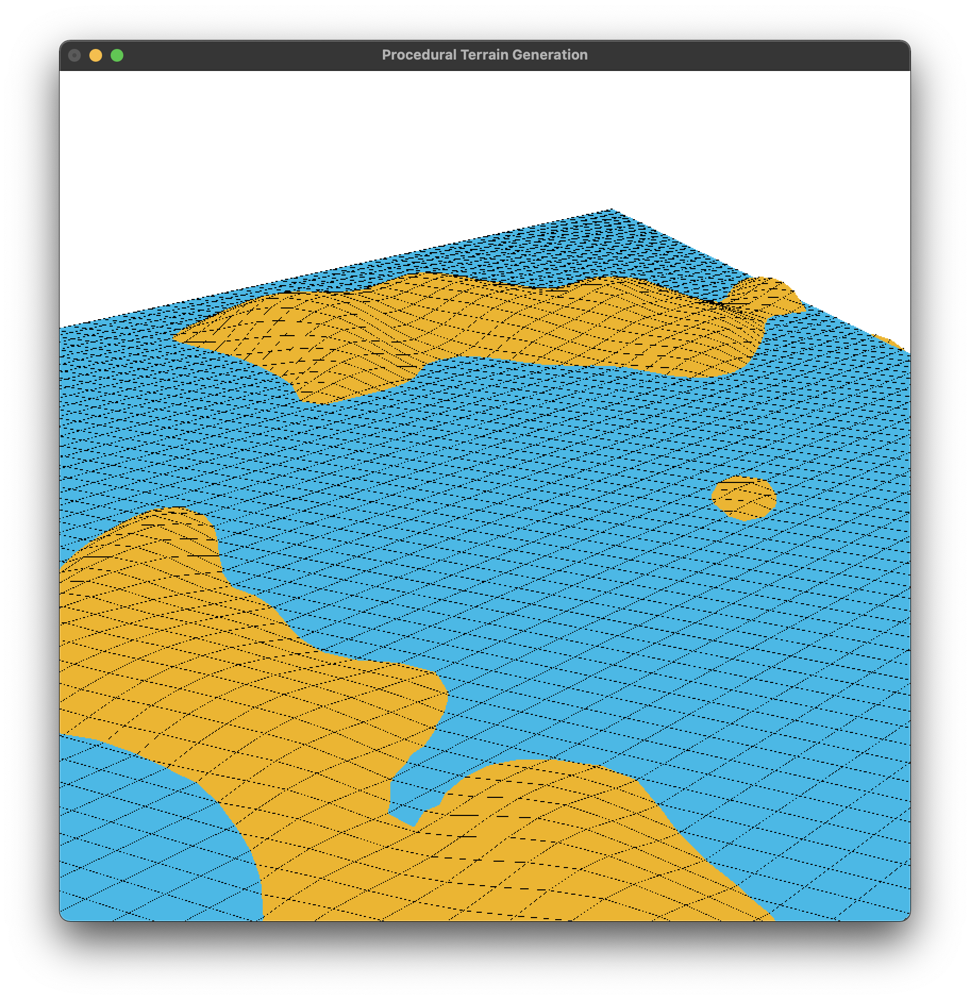
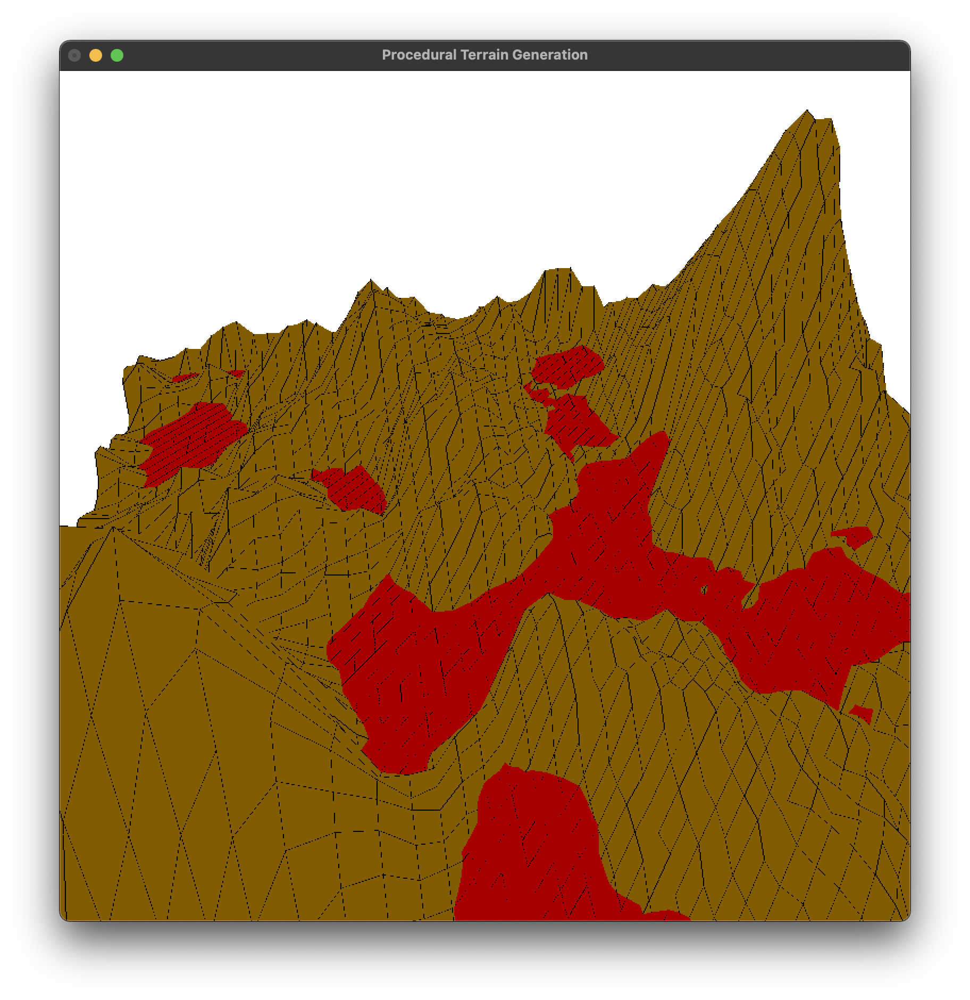
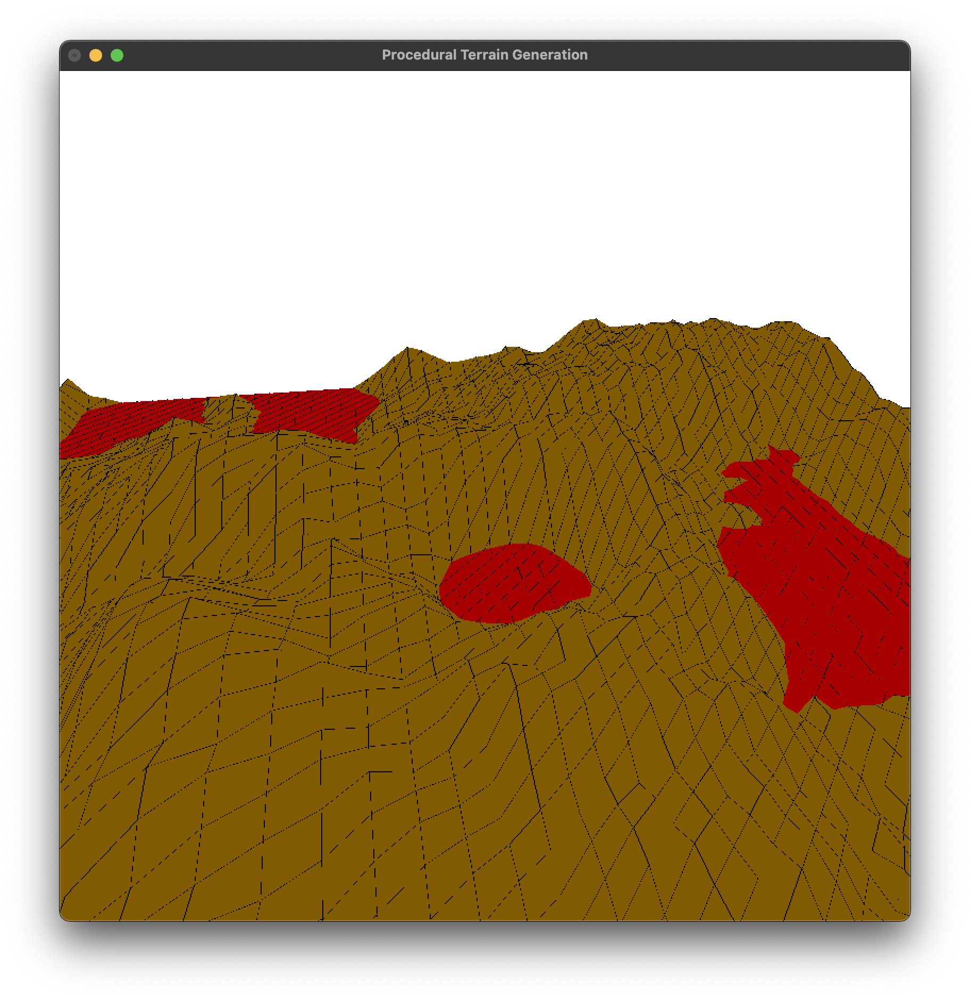

# PTG
Customizable Grammar-based Procedural Terrain Generation

Spring 2021 CS33400 Final Project @ Purdue

See example [grammar file](grammar.txt).

## Example outputs

### Water

### Islands

### Lava lake

### Crater

